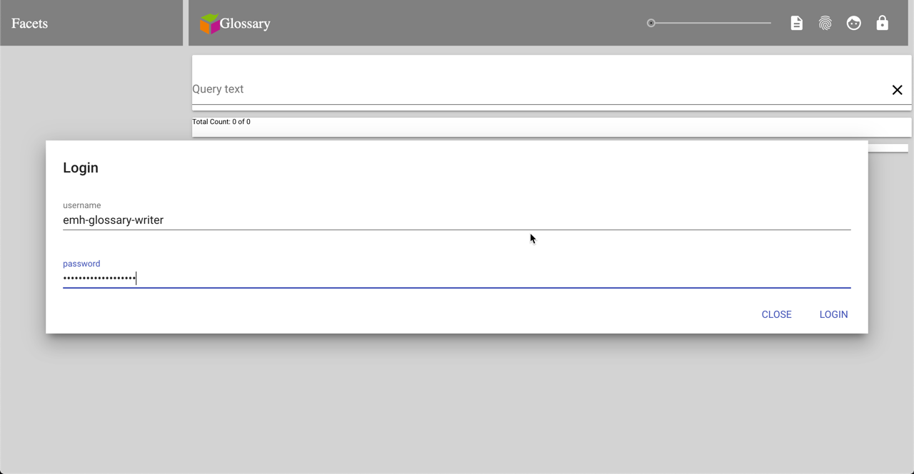
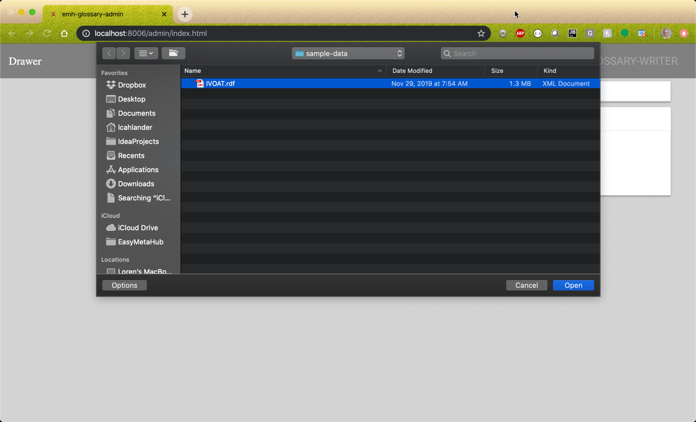
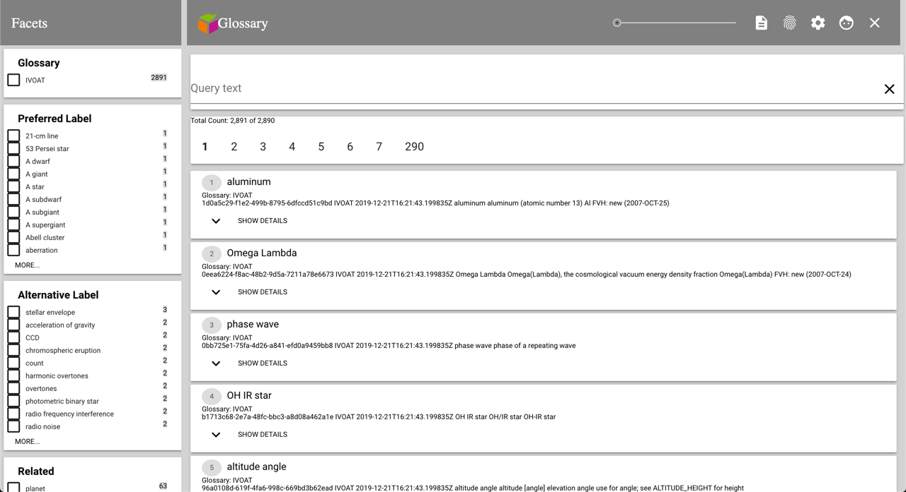
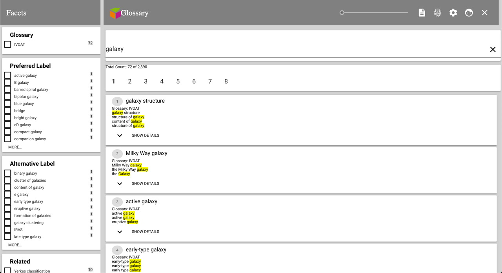

# EasyMetaHub Glossary Manager for MarkLogic

This application is a glossary viewer with an xqDoc viewer and the 
RESTful OpenAPI viewer for the REST services defined using the XQRS 
implementation of RestXQ.

*There will be an enhancement for adding the MarkLogic default REST Services later.*

## Basic installation and getting started is here:

In the root directory of the application run:

```gradle mlDeploy```

The application is deployed to port *8006* as the application *emh-glossary-xqrs*

Go to the administrative screen for the server and change the authentication 
to *application-level* and the default user to *emh-glossary-reader*

Open 
[http://localhost:8006](http://localhost:8006) and you get the following.


Searching requires a user with the role *emh-glossary-reader*.  To load a glossary, login as *emh-glossary-writer* with the 
password *emh-glossary-writer*



Click on the upload icong in the Facets header.


Click on the *Upload Files...* button.


Select the *IVOAT.rdf*  in the *sample-data* folder.



Close the dialog and the page refreshes with the current data.



Type *galaxy* in the search bar and you get the following.



You can then select a facet to narrow the search results.  You can also expand a result item by selecting *Show Details*


If you select one of the buttons for *Related*, *Broader*, or *Narrower*, then you will be hyperlinked to that *Concept*


## Customizing

The following three files are the ones to customize to change the application from a 
glossary application to one of your own content.

* src/main/ml-modules/root/modules/custom/custom.xqm
* src/main/ml-config/databases/content-database.json
* src/main/polymer/root/src/emh-accelerator-app/emh-accelerator-app.js
* src/main/polymer/root/src/emh-accelerator-app/result-item.js

### custom.xqm

This file has the abstracted out customization layer for handling *search* and *content upload*

#### Search

The search cutomization is handled in two different functions in this 
XQuery Library Module.

```
(:~
 : Returns the search option for the query.
 :
 : @return The search options for the search:search() call in the search module.
 :)
declare function custom:search-options()
```
That returns the XML search options.  These options define the constraints 
for the search as well as the facets for the search.

```
(:~
 : Generates the JSON object for a result item.
 :
 : @param $result A 'search:result' object from the search results
 : @param $show-snippets A flag for whether to show the snippets.
 : @return The JSON object that represents a result item in the client page
 :)
declare function custom:result-object($result as node(), $show-snippets as xs:boolean)
```

This is called for each result that is returned from the search.


#### Upload

The upload customization is used to take the uploaded file and perform the 
proper processing of the file before it is stored in the content database.

```
(:~
 : This function processes the file that was uploaded through the upload dialog.
 :
 :  @param $filename The name of the file that has ben uploaded
 :  @param $file     The file that has been uploaded.
 :  @return An array of JSON objects as { "type": error-type, "message": error-message }
 :)
declare function custom:process-upload($filename as xs:string, $file)
as object-node()*
```

### content-database.json

### result-item.js

### emh-accelerator-app.js

## Others

* README.md
* build.gradle
* gradle.properties
* src/main/ml-config/databases/content-database.json
* src/main/ml-config/rest-api.json
* src/main/ml-config/security/roles/1-emh-glossary-nobody-role.json
* src/main/ml-config/security/roles/2-emh-glossary-reader-role.json
* src/main/ml-config/security/roles/3-emh-glossary-writer-role.json
* src/main/ml-config/security/roles/4-emh-glossary-internal-role.json
* src/main/ml-config/security/roles/5-emh-glossary-admin-role.json
* src/main/ml-config/security/users/emh-glossary-admin-user.json
* src/main/ml-config/security/users/emh-glossary-reader-user.json
* src/main/ml-config/security/users/emh-glossary-writer-user.json
* src/main/ml-config/servers/xqrs-server.json
* src/main/ml-modules/options/emh-glossary-options.xml
* src/main/ml-modules/rest-properties.json
* src/main/ml-modules/root/example-guestbook.xqy
* src/main/ml-modules/root/example.xqy
* src/main/ml-modules/root/favicon.ico
* src/main/ml-modules/root/guestbook.css
* src/main/ml-modules/root/images/app-icon-144.png
* src/main/ml-modules/root/images/app-icon-32.png
* src/main/ml-modules/root/images/chrome-splashscreen-icon-384x384.png
* src/main/ml-modules/root/images/chrome-touch-icon-192x192.png
* src/main/ml-modules/root/images/icon-128x128.png
* src/main/ml-modules/root/images/icon-512x512.png
* src/main/ml-modules/root/images/icon-72x72.png
* src/main/ml-modules/root/images/icon-96x96.png
* src/main/ml-modules/root/images/ms-icon-144x144.png
* src/main/ml-modules/root/images/powered-by-marklogic.png
* src/main/ml-modules/root/modules/config.xqm
* src/main/ml-modules/root/modules/custom/custom.xqm
* src/main/ml-modules/root/modules/emh-json.xqm
* src/main/ml-modules/root/modules/search-xqrs.xqy
* src/main/ml-modules/root/modules/upload-xqrs.xqy
* src/main/ml-modules/root/openapi/index.html
* src/main/ml-modules/root/openapi/openapi.xqy
* src/main/ml-modules/root/openapi/rxq2xqdoc2openapi-lib.xqy
* src/main/ml-modules/root/openapi/services2xqdoc2openapi-lib.xqy
* src/main/ml-modules/root/openapi/xqrs2xqdoc2openapi-lib.xqy
* src/main/ml-modules/root/xqdoc-lib.xqy
* src/main/polymer/root/favicon.ico
* src/main/polymer/root/images/app-icon-144.png
* src/main/polymer/root/images/app-icon-32.png
* src/main/polymer/root/images/chrome-splashscreen-icon-384x384.png
* src/main/polymer/root/images/chrome-touch-icon-192x192.png
* src/main/polymer/root/images/icon-128x128.png
* src/main/polymer/root/images/icon-512x512.png
* src/main/polymer/root/images/icon-72x72.png
* src/main/polymer/root/images/icon-96x96.png
* src/main/polymer/root/images/ms-icon-144x144.png
* src/main/polymer/root/images/powered-by-marklogic.png
* src/main/polymer/root/index.html
* src/main/polymer/root/manifest.json
* src/main/polymer/root/package-lock.json
* src/main/polymer/root/package.json
* src/main/polymer/root/polymer.json
* src/main/polymer/root/src/emh-accelerator-app/emh-accelerator-app.js
* src/main/polymer/root/src/emh-accelerator-app/facet-card.js
* src/main/polymer/root/src/emh-accelerator-app/facet-selector.js
* src/main/polymer/root/src/emh-accelerator-app/result-item-button.js
* src/main/polymer/root/src/emh-accelerator-app/result-item.js
* src/main/polymer/root/src/emh-accelerator-app/search-snippet-highlight.js
* src/main/polymer/root/src/emh-accelerator-app/upload-item.js
* src/main/polymer/xqDoc/README.md
* src/main/polymer/xqDoc/index.html
* src/main/polymer/xqDoc/manifest.json
* src/main/polymer/xqDoc/package-lock.json
* src/main/polymer/xqDoc/package.json
* src/main/polymer/xqDoc/polymer.json
* src/main/polymer/xqDoc/src/xqdoc-app/function-detail.js
* src/main/polymer/xqDoc/src/xqdoc-app/hash-button.js
* src/main/polymer/xqDoc/src/xqdoc-app/import-detail.js
* src/main/polymer/xqDoc/src/xqdoc-app/module-selector.js
* src/main/polymer/xqDoc/src/xqdoc-app/variable-detail.js
* src/main/polymer/xqDoc/src/xqdoc-app/xqdoc-app.js
* src/main/polymer/xqDoc/src/xqdoc-app/xqdoc-comment.js
* src/main/polymer/xqDoc/src/xqdoc-app/xqdoc-module.js
* xqDoc/openapi.json

## xqDoc

Open 
[http://localhost:8006/xqDoc](http://localhost:8006/xqDoc) and you get the following.


## OpenAPI

Open 
[http://localhost:8006/openapi](http://localhost:8006/openapi) and you get the Swagger UI of the RESTful services
of the application.


## Training Available

[EasyMetaHub](http://easymetahub.com) is available for training in proper
XQuery documentation and OpenAPI generation.